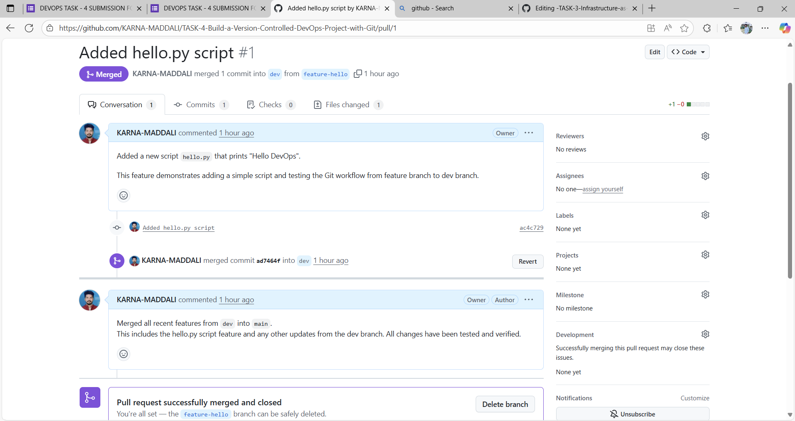
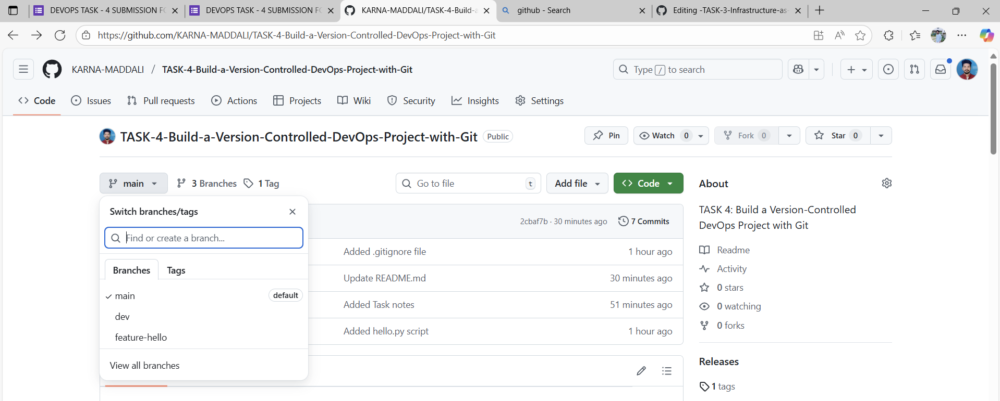

# Task 4 DevOps Git Practice Project 


This project is part of Task 4: Build a Version-Controlled DevOps Project with Git.
The goal is to practice Git branching, pull requests, merging, tagging, and documentation in a real-world workflow.

🏗️ Step-by-Step Practice Plan
🔹 1. Create a Local Project
mkdir devops-task4
cd devops-task4
echo "# DevOps Git Practice Project" > README.md
git init
git add .
git commit -m "Initial commit"

🔹 2. Create a Remote GitHub Repo

Go to GitHub → New Repository → name it devops-task4.

Copy repo link (HTTPS).

git remote add origin https://github.com/your-username/devops-task4.git
git branch -M main
git push -u origin main

🔹 3. Create Branches
git checkout -b dev
git push -u origin dev

git checkout -b feature-hello

🔹 4. Work on Feature Branch

Example script:

echo "print('Hello DevOps')" > hello.py
git add hello.py
git commit -m "Added hello.py script"
git push -u origin feature-hello


Go to GitHub → Create a Pull Request (feature-hello → dev).

Merge it. ✅

🔹 5. Merge Dev into Main

Once you have features ready:

Open a PR from dev → main.

Merge it. ✅

🔹 6. Add .gitignore
echo "*.log" > .gitignore
git add .gitignore
git commit -m "Added .gitignore file"
git push

🔹 7. Tag a Version
git tag v1.0
git push origin v1.0

🔹 8. Document the Project

Create TASK4_NOTES.md:

# Task 4 - Git Practice

## Steps I followed
1. Initialized repo
2. Created branches (main, dev, feature)
3. Added hello.py script
4. Used Pull Requests to merge
5. Added .gitignore
6. Created tags

## What I Learned
- Git branching
- Pull requests
- Conflict resolution
- Git tags and .gitignore


Commit and push it. ✅
 


Branches: main, dev, feature-*

Pull Requests: history of merges

Commits: meaningful commit messages

Tags: version tags like v1.0

🎯 What You’ll Learn

Initializing and managing a Git project

Creating and switching between branches

Writing commits and pushing to remote

Pull Request (PR) workflow for collaboration

Using .gitignore effectively

Tagging versions for release management

---

## 🛠 Tools & Technologies
- **Git** (Version Control System)  
- **GitHub** (Remote repository hosting)  
- **Markdown** (Documentation)  

---

## 📂 Project Structure

```bash
devops-task4/
│── README.md          # Project documentation
│── hello.py           # Example feature script
│── .gitignore         # Ignored files
│── TASK4_NOTES.md     # Detailed notes on the task
│── images/            # Screenshots and project images


Branches used:
- `main` → Stable production-ready code  
- `dev` → Integration/testing branch  
- `feature-*` → For adding new features  

Tags:
- `v1.0` → First release  

---

## 🔄 Workflow Followed
1. **Initialized repository** locally and pushed to GitHub.  
2. **Created branches**: `main`, `dev`, and `feature-*`.  
3. **Developed features** inside feature branches.  
4. **Created Pull Requests (PRs)** to merge feature branches into `dev`.  
5. **Merged dev into main** after testing.  
6. **Added `.gitignore`** file to keep the repo clean.  
7. **Tagged version** as `v1.0`.  
8. **Documented steps** in `TASK4_NOTES.md`.  

---

## 🚀 How to Run This Project
1. Clone the repository:  
   ```bash
   git clone https://github.com/YOUR_USERNAME/devops-task4.git
   cd devops-task4


Checkout the main branch:

git checkout main


Run the sample script:

python hello.py


✅ Output: Hello DevOps

## Screenshots
 

## Screenshots
 

 ## Screenshots
 


📖 What I Learned

Difference between merge and rebase

How to resolve merge conflicts

How to use git stash for saving temporary changes

Importance of .gitignore

How to mark releases with git tags

How real-world teams use branching and pull requests

❓ Interview Questions Prepared

What is Git?

What is the difference between merge and rebase?

What is a pull request?

How do you resolve merge conflicts?

What are Git tags?

What is Git workflow?

Explain git stash.

What is the use of .gitignore?

🏁 Conclusion

This project helped me practice Git workflows in a real DevOps style.
Now I understand how version control is used in professional projects and how teams collaborate using Git and GitHub.
